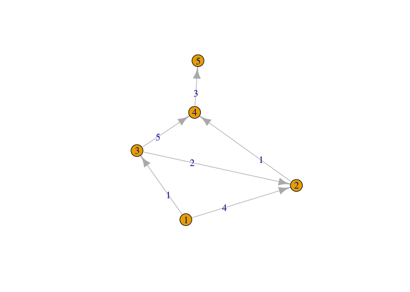
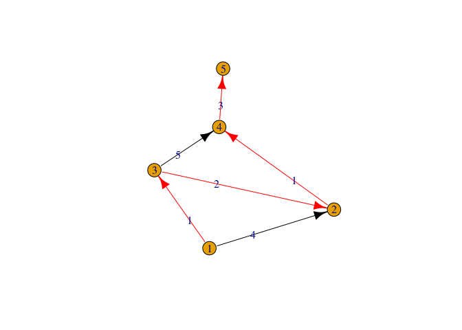

<!-- README.md is generated from README.Rmd. Please edit that file -->

# Medium-Hard test result

<!-- badges: start -->
<!-- badges: end -->

## the task

-   Medium: set up a GitHub repo with a new R package; use r-lib/actions
    to automatically check the package after every commit; play with the
    GitHub action so that some test functions are run.
-   Hard: implement Dijkstra’s algorithm with C++ with an Rcpp interface
    in your package. Run the test on the Wiki page.

## installation of the package

## how to use the package
the package have a function that calculate the shortest path of a graph using the dijakstra algorithm, it takes as an input an adjacency matrix and the starting node in which we want to start running the algorithm, the function will return a matrix with 2 rows , the first row is a vector that represent the shortest distance from the starting node to each the other nodes, the second row represent the previous vector, which have what is the previous node that we have to come from so we'll get the shortest distance.

## adjacency matrix input

    #>      [,1] [,2] [,3] [,4] [,5]
    #> [1,]    0    4    1    0    0
    #> [2,]    0    0    0    1    0
    #> [3,]    0    2    0    5    0
    #> [4,]    0    0    0    0    3
    #> [5,]    0    0    0    0    0

## visualtization of the graph

<!-- -->

## the result of the dijkstra algorithm

    #>          [,1] [,2] [,3] [,4] [,5]
    #> distance    0    3    1    4    7
    #> previous   -1    2    0    1    3

## visualization of the dijakstra algorithm

<!-- -->
